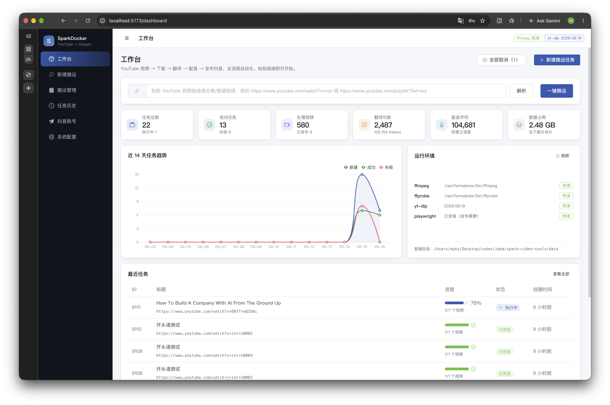
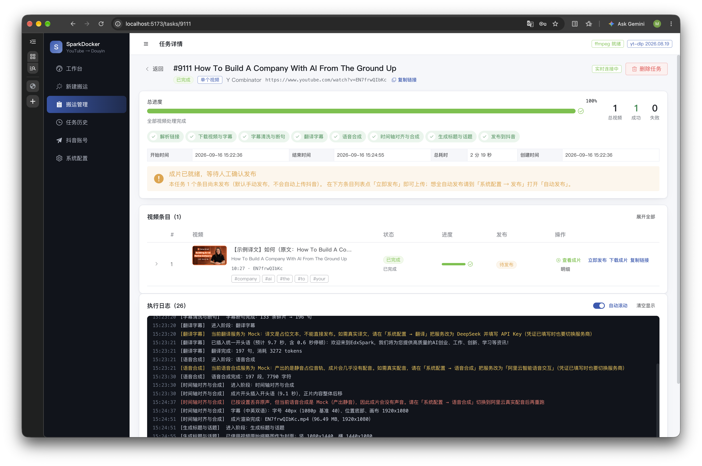
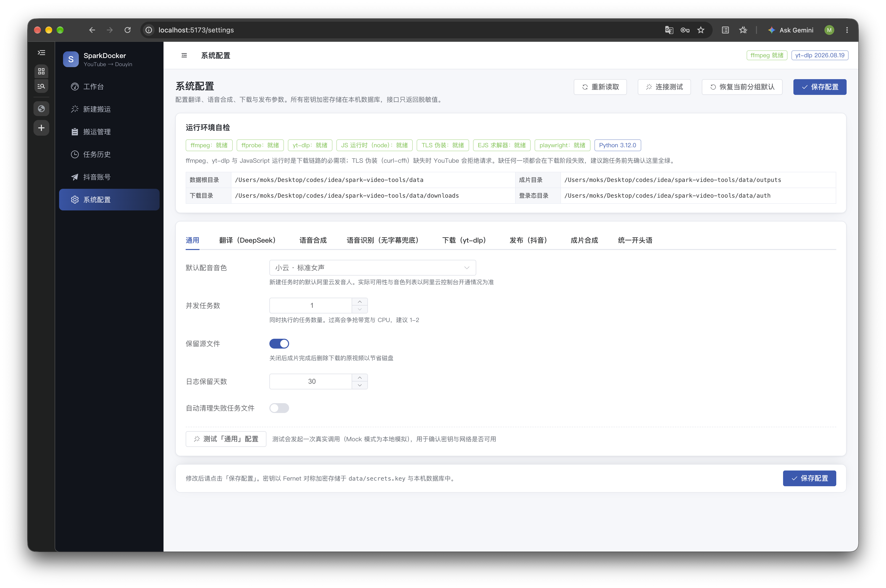

# SparkDocker · YouTube 视频搬运工作台

输入一个 YouTube 视频 / 合集 / 频道链接，自动完成 **下载 → 英译中 → AI 配音 → 字幕合成 → 发布到抖音** 的全流程，并提供搬运管理（任务进度、历史）与系统配置界面。





```

YouTube 链接
   │
   ├─ 1. 解析链接         yt-dlp 提取信息（单视频 / 合集 / 频道）
   ├─ 2. 下载            yt-dlp 视频 + 字幕 + 缩略图（优先人工字幕，回退自动字幕）
   ├─ 3. 获取原文         视频自带字幕优先（人工 → 自动）；
   │                     没有字幕则用阿里云语音识别转写（按静音边界切块）
   │                     再合并滚动重复行、去重、按句末标点断句
   ├─ 4. 翻译             DeepSeek 英译中（带上下文、术语表，JSON 输出保证逐句对齐）
   │                     在译文最前面插入「统一开头语」并把正片字幕整体后移（可选）
   ├─ 5. 语音合成         chat-tts或阿里云智能语音交互（ISI）逐句 TTS，并发 + 断点续跑
   ├─ 6. 时间轴对齐       每句严格压进原字幕时间窗（先加速后截断，避免累积漂移）
   │                     再与原视频背景音按比例混音；开头语占用成片开头的独立时段
   ├─ 7. 成片渲染         ffmpeg 烧录中文字幕 + 可选竖屏 9:16 转换 + 封面抽取
   ├─ 8. 文案生成         DeepSeek 生成中文标题与话题标签
   └─ 9. 发布            Playwright 驱动抖音创作者中心，自动上传并发布
```

---


## 快速开始

### 依赖

| 组件 | 用途 | 安装 |
| --- | --- | --- |
| Python 3.10+ | 后端 | `brew install uv`（本仓库用 uv 管理虚拟环境） |
| Node 20+ | 前端 | `brew install node` |
| **ffmpeg / ffprobe** | 媒体处理（必需） | `brew install ffmpeg` |
| **JavaScript 运行时** | YouTube 提取（必需） | 本项目会自动探测：有 `node` 即可；也可 `brew install deno` |
| yt-dlp / curl-cffi / yt-dlp-ejs | 下载（Python 依赖） | 随后端依赖自动安装 |
| Playwright + Chromium | 抖音发布（必需） | `pip install playwright && playwright install chromium` |

> **为什么需要 JavaScript 运行时**：YouTube 现在的签名解算依赖 JS 执行，yt-dlp 默认只启用 `deno`。
> 本机的 `node` 通常已够用——项目会自动探测（deno > node > bun > quickjs）并显式告知 yt-dlp，
> 无需手工配置。缺 `curl-cffi`（TLS 指纹伪装）时 YouTube 会直接拒绝请求，该依赖已默认安装。

启动后在「系统配置」顶部的**运行环境自检**里可以看到这几项的实时状态；跑长任务前建议先确认全绿。
下载分组的「连接测试」会真实访问一次 YouTube，是最可靠的连通性验证。

### 启动

```bash
# 生产形态：构建前端 → 后端单端口托管（含 API 与 WebSocket）
#   → http://127.0.0.1:8720
./scripts/start.sh

# 开发形态：后端热重载 + Vite dev server（改代码即时生效）
#   → http://localhost:5173
./scripts/dev.sh
```

两个脚本都会自动完成环境准备，无需手动建虚拟环境或装依赖：

1. 探测 `node` / `npm`（PATH → `$NVM_DIR` → `~/.nvm/versions/node/*/bin`，取版本最高者）与 `ffmpeg`
2. 缺失时创建 `backend/.venv`（Python 3.12）并安装依赖
3. 缺失时执行 `npm install`
4. 生产形态额外执行前端构建 `npm run build`
5. 端口被占用时**明确报错并列出占用进程**，不会静默失败

| 环境变量 | 默认 | 说明 |
| --- | --- | --- |
| `SPARK_PORT` | `8720` | 后端端口 |
| `VITE_PORT` | `5173` | 前端 dev server 端口（仅 `dev.sh`） |

```bash
# 换端口启动
SPARK_PORT=9000 ./scripts/start.sh

# 传递给 uvicorn 的额外参数
./scripts/start.sh --reload

# 停止服务：前台运行时 Ctrl+C
kill $(lsof -nP -iTCP:8720 -sTCP:LISTEN -t)
```

> 开发形态下 Vite 会把 `/api`（含 WebSocket）代理到 `SPARK_PORT` 指定的后端，
> 改端口时两个服务会保持一致，无需手动改 `vite.config.ts`。

### 离线自检（不需要任何密钥）

先确认本机环境与整条流水线可用：

```bash
cd backend && .venv/bin/python ../scripts/verify_pipeline.py
```

该脚本会用 ffmpeg 生成一段测试视频与英文假字幕，跑完整条流水线（Mock 翻译 / Mock 配音 / Mock 发布），
输出各阶段明细、成片路径，并抽取两帧便于肉眼检查字幕效果。可用 `--out <目录>` 指定产物目录、`--aspect 9:16` 指定画面比例。

### 运行测试

```bash
cd backend && .venv/bin/python -m pytest tests/ -q
```

---

## 配置密钥

启动后进入 **系统配置** 页面填写，全部配置加密存储在本机（`data/secrets.key` + SQLite），接口只返回脱敏值。

### 1. 翻译（DeepSeek）

| 项 | 说明 |
| --- | --- |
| 翻译服务 | `deepseek`（真实） / `mock`（离线示例） |
| DeepSeek API Key | 在 [platform.deepseek.com](https://platform.deepseek.com) 创建 |
| 温度 | 官方建议翻译类任务使用 **1.3** |
| 术语对照表 | JSON，如 `{"OpenAI":"OpenAI"}`，固定专有名词译法 |
| 翻译风格提示词 | 直接决定译文的口语化程度，可按频道调性改写 |

### 2. 语音合成（阿里云智能语音交互）

参考官方文档：[语音合成 RESTful API](https://help.aliyun.com/zh/isi/developer-reference/restful-api-3)

| 项 | 说明 |
| --- | --- |
| AccessKey ID / Secret | 阿里云 RAM 用户密钥，**建议使用只授予 ISI 权限的子账号** |
| 项目 AppKey | 智能语音交互控制台「创建项目」后获得 |
| 手工 Token | 可选。留空则由 AK/SK 自动签发（24 小时有效，进程内自动续期） |
| 发音人 | 内置常用发音人列表，实际可用性取决于控制台开通情况 |
| 采样率 | 部分音色仅支持 8000/16000/24000，报错时下调 |

> 单次请求文本上限 **300 字符**，超长句子会按标点自动切分后拼接。

#### 本地 ChatTTS 通道

ChatTTS 是本机/内网服务（`./scripts/chattts.sh`），听感比云端自然，但对**长文本与混排文本**更挑。
本项目在提供者里做了三件事（参考 [ChatTTS-LongAudio](https://github.com/) 的做法）：

| 设置 | 默认 | 作用 |
| --- | --- | --- |
| 单次请求字数上限 | 80 | 超过就切成多片分别合成，每片**先裁首尾静音再拼接**——否则片与片之间会凭空多出近 1 秒死寂 |
| 文本归一化 | 开 | 英文缩写拆字母（`AI` → `A I`）、百分号/单位/标点中文化（`15.5%` → `百分之15点5`） |
| 术语读法 | 空 | 每行一条「原文=读法」，修正品牌名与专有名词；只写原文则按逐字母展开 |

⚠️ 归一化**只作用于送进模型的文本**，字幕、标题、话题都保持原文——观众看到的是「AI创业」，不是「A I 创业」。
找不到合适的本地模型服务时，也可以直接把服务地址指向 ChatTTS-LongAudio 的 `/tts`：
它会返回「JSON + 音频 URL」，本项目会自动下载该 URL（同时兼容 base64 响应与
`{"code":1,"msg":...}` 业务错误）。

### 3. 语音识别（无字幕视频的兜底）

**视频没有字幕时，会自动用语音识别生成原文**，再走常规的翻译 → 配音 → 替换音轨流程，
而不是简单保留原声。

- 凭证复用「语音合成」的阿里云 AccessKey 与项目 AppKey，无需重复填写
- **重要**：该 AppKey 所属项目必须在控制台「项目功能配置」里选择与音频语种匹配的识别模型。
  英文视频必须选英文模型，否则识别结果为空（这是最常见的失败原因）
- 长视频处理方式：先用 ffmpeg `silencedetect` 找出语音区间，**按静音边界**切成 ≤40 秒的块
  （避免把单词切一半，且每块起点就是真实语音起点），逐块识别后再按字符数比例分配时间轴
- `识别时长上限` 默认 0（不限）。语音识别按音频时长计费，长视频建议设上限避免意外开销
- 识别失败**不会**让任务失败：会记录原因并退回「保留原声」，成片照常产出

```bash
# 离线验证这条兜底链路（不调用任何外部服务）
cd backend && .venv/bin/python ../scripts/verify_pipeline.py --no-subtitle
```

### 4. 下载（yt-dlp）

- **代理**：中国大陆环境访问 YouTube 通常必须配置，例如 `http://127.0.0.1:7890`
- **Cookies 文件**：遇到需要登录的视频（年龄限制等）时填写 `cookies.txt` 绝对路径
- **字幕语言**：默认 `en, en-US, en-GB, en-orig`

### 5. 发布（抖音）

**默认无头发布：不弹出浏览器窗口。** 实测用已保存的登录态，无头浏览器能正常打开
创作者中心上传页（未登录会被踢回登录页，此时会明确报错）。

- 首次扫码登录**仍然需要可见窗口**（要把二维码显示给人扫），登录一次之后发布可全程无头
- 无头模式更容易触发平台的身份验证/验证码，这类校验必须有可见窗口才能人工完成。
  因此命中风控时会**自动降级为有头重试一次**（可在配置里关闭），而不是直接失败
- 本工具会尝试在「作品声明」中如实勾选「内容由AI生成」

#### 为什么不用纯 HTTP 接口发布

抖音 Web 端接口要求**三件套签名**，缺任何一个都返回 `403 Sign Invalid`：

| 参数 | 来源 |
| --- | --- |
| `a_bogus` | bdms/webmssdk（JSVMP 混淆的虚拟机字节码） |
| `timestamp` | 客户端时间 |
| `x-secsdk-web-signature` | securitySDK，依赖浏览器 localStorage 里的会话密钥 |

已有公开的逆向研究（如 [douyin-api 的签名结论](https://github.com/mafqla/douyin-api/blob/main/docs/REVERSE_GUIDE.md)）表明，
要纯 HTTP 调用必须：在 Node 里补出 `window/document/localStorage/crypto.subtle` 环境去跑抖音自己的
混淆 JS、把浏览器会话密钥导出注入、并保证 cookie 与密钥来自同一会话。**本质上仍是让官方 JS 来签名**，
只是把浏览器换成了自己维护的 JS 运行时——维护成本更高、随平台更新随时失效，且上传接口比 feed 接口更复杂。

浏览器自动化之所以更稳，是因为它直接运行平台页面的真实代码；无头模式已经去掉了「弹窗」这一唯一的体验负担。

如确实需要完全脱离浏览器，合规路径是**抖音开放平台**的官方内容发布能力（需企业主体认证并申请权限）。


参考实现思路来自 [social-auto-upload](https://github.com/dreammis/social-auto-upload)。

- 首次使用需到 **抖音账号** 页面点击「扫码登录」，在弹出的浏览器里用抖音 App 扫码
- 登录态保存在 `data/auth/douyin_default.json`
- **真机部署建议**：把 `patchright` 替换 `playwright` 可显著降低自动化特征被识别的概率

### 6. 成片合成

- **画面比例**：抖音推荐 `9:16`，主画面居中、两侧用放大模糊背景填充，避免黑边
- **字幕内容**：中英双语（中文一行、英文一行）/ 仅中文 / 仅英文
- **字幕位置**：底部居中（默认）/ 画面中央 / 顶部居中
- **原视频音轨**：默认**完全去掉**（人声与背景音乐都不保留），成片只有 AI 配音；
  也可切换为「保留并压低音量」。注意若配音仍是 Mock（静音），去掉原声后成片会完全没声音
- **字幕字体**：留空自动选择系统中可用的中文字体。**注意**：macOS 的 `PingFang SC` 会被 fontconfig 解析到 libass 打不开的 `.ttc`，触发静默字体回退，因此不在候选中
- **最大加速比**：中文语速慢于英文时会超出原时间窗，允许加速的上限；仍超长则截断该句

#### 封面

默认**使用视频原始缩略图**（`cover_source = thumbnail`）：YouTube 封面由创作者
为吸引点击专门设计，效果通常好于程序生成的模板。

- 自动升级到最高清版本：yt-dlp 有时只给 `hqdefault`（480x360），会换成
  `maxresdefault`（1280x720），清晰度差别肉眼可见
- 远程取不到时退回本地已下载的缩略图文件（国内网络常访问不到 `ytimg.com`）
- 比例不一致时采用「完整显示 + 模糊铺满背景」，不裁掉创作者压在边角的标题

**同时生成竖封面与横封面**：抖音对两种封面**分开取图**，弹窗里是「设置竖封面」
「设置横封面」两个页签，横封面固定 **4:3**（界面原文：「横封面预览（4:3）」）。
只设竖封面会让横版位一直空着，因此本工具会按各自比例各生成一张并依次上传：

| 封面 | 尺寸 | 比例 |
| --- | --- | --- |
| 竖封面 | 1080x1440 | **3:4** |
| 横封面 | 1440x1080 | **4:3** |

> **比例必须严格一致**：平台以 `object-fit: cover` 投放封面，比例不匹配就会被居中裁切，
> 只露出中间一条。实测封面位元素为 90x120（0.750 = 3:4）与 160x120（1.333 = 4:3）。
> 注意竖封面**不是** 9:16，也不能沿用成片比例——16:9 的成片放进 3:4 的位子就会被裁。

另外两种可选项：

| `cover_source` | 说明 |
| --- | --- |
| `thumbnail`（默认） | 视频原始缩略图 |
| `generated` | 程序生成的科技风设计稿：深色渐变 + 强调色光晕 + 细网格 + 斜向光带 + 暗角颗粒，排上中文标题与话题标签 |
| `frame` | 从成片抽一帧 |

> `generated` 的底图完全由程序绘制，不使用视频画面——很多视频开头是纯黑或纯白帧，
> 用截图做底图会得到黑底或白底封面。生成式背景对任何视频都能给出稳定效果，
> 且同一标题可复现（重跑任务不会无故换封面）。

#### 字号与边距为什么是「1080p 基准」

字幕**不是**直接把 SRT 交给 ffmpeg 烧录的，而是先生成自带样式的 ASS。原因：

libass 解析 SRT 时会套用 ASS 的默认坐标系（`PlayResY=288`），于是 `FontSize`/`MarginV`
会被放大「画布高度 ÷ 288」倍。实测在 1920 高的画面上，`FontSize=20` 渲染出 **123px** 的字、
`MarginV=60` 变成 **404px** 的底部留白——设置完全不可预期。

因此本工具显式生成 `PlayResX/PlayResY = 成片分辨率` 的 ASS，`FontSize` 与 `MarginV`
就是**真实像素**。而设置项统一以 **1080p 为基准**，再按成片分辨率等比缩放，
这样同一套配置在不同分辨率下观感一致：

| 设置（1080p 基准） | 1920x1080 成片 | 1080x1920 竖屏 |
| --- | --- | --- |
| 字号 14px | 实际 14px | 实际 25px |
| 边距 40px | 实际 40px | 实际 71px |

---

## 使用流程

1. **新建搬运** → 粘贴链接 → 「解析」确认条目
2. 链接是合集/频道时会先弹出**条目列表**（封面、标题、时长、发布日期、播放量），勾选要搬运的视频并「确定并继续」后才允许创建任务；单个视频链接不弹窗
3. 设置本次任务的音色、画面比例、是否自动发布、定时发布、话题与简介
4. 「创建并开始执行」，跳转到任务详情页实时查看进度（WebSocket 推送）
5. **搬运计划**（可选）把「什么时候搬什么」预先排好，到点自动建任务并执行
6. **搬运管理** 中查看所有任务、取消、重试失败项、按任务清理文件
7. **搬运历史** 中检索、复跑、导出 CSV

### 搬运计划（定时自动搬运）

「搬运计划」页把要搬的链接和运行时间预先存下来，到点由调度器自动创建任务：

- **运行方式**：仅手动 / 按间隔（每 N 分钟）/ 每天定时（可多个时间点）/ 每周定时（选星期）/
  定时一次；**时间按本机时区计算**，界面直接显示下一次执行时间
- **搬运范围**：最新 N 个（适合持续更新的频道）/ 前 N 个 / 全部 / 序号区间，
  并可勾选「跳过已搬运过的视频」——开启后同一个视频不会被搬第二次
- **手动执行**：随时点「立即运行」跑一次（不影响已排好的定时）；
  「预演」只解析并列出这次会搬哪些条目、哪些已搬过，不创建任务
- **暂停/启用**：暂停只影响后续触发，正在执行的任务不受影响；一次性计划跑完自动关闭
- **执行记录**：每个计划可查看它创建过的任务列表，直接跳转到任务详情
- 计划产出的任务与手动创建的任务完全一样，会写 `plan_id` 便于回溯；
  删除计划不会删除它创建过的任务与文件

调度器是进程内的后台循环（每 20 秒检查一次），触发前先把下次执行时间推进并落库，
因此**重启或崩溃都不会对同一时间点重复触发**；计划执行失败会记录原因并继续等下一次，
不会把整个调度器卡死（接口 `GET /api/plans/meta` 能看到调度器状态）。

### 合集条目选择

合集/频道动辄几十上百个视频，解析即建任务会一次性把队列塞满，因此创建流程做了拦截：

- 解析到合集后先弹列表：**默认全选**，用户只需取消不想要的；支持「选中本页 / 前 10 个 / 前 20 个 / 清空」以及表头全选
- 底部实时显示「已勾选 N / 总数」与预计原片总时长；勾选超过 20 个时额外提醒影响面
- 未确认前页面上只有一块提示面板，「处理与发布选项」和创建按钮都不出现，无法绕过
- 确认后仍可「重新选择」回到列表；改动链接会让勾选失效，必须重新解析确认
- 提交时前端只发送勾选的 `selected_video_ids`（全选发送 `["all"]`），后端按勾选精确建条目，并在任务日志中写明「已挑选 N 个视频（合集共 M 个）」

### 复制链接

原视频（YouTube）链接在三处都能一键复制，省去手动选中：

- **搬运管理** 列表：任务行操作列与链接旁边各有一个「复制链接」；点按钮不会触发行点击跳转
- **任务详情**：头部来源链接旁，以及下方条目操作列的「复制链接」（复制该条目自己的原始链接）

复制优先用 `navigator.clipboard`，在非安全上下文（局域网 IP 访问）自动回退到 `textarea + execCommand`；
复制空链接或失败时会明确提示，不会静默失败。

### 查看成片

任务完成后可在页面内直接预览成片视频，无需先下载：

- **搬运管理** 列表：有产出的任务显示「N 个成片可看」与「看成片」按钮，点一下直达播放器
- **任务详情**：三种入口——条目行的「查看成片」、缩略图上的播放遮罩、展开明细里的「查看成片视频」
- 播放器支持**拖动进度条**：后端通过 HTTP Range（206 分段响应）按需传输，
  690MB 的成片也不会被整体读进内存
- 关闭对话框时自动暂停并释放 `<video>`，避免声音继续播放、连接被占住
- 播放器内可直接「下载成片」或「新窗口打开」

对应接口：`GET /api/tasks/{id}/items/{item_id}/file?kind=output&inline=1`
（`inline=1` 用于内嵌播放；不带该参数则为附件下载）

### 统一开头语

「系统配置 → 统一开头语」可以给所有成片统一加上一句开场白（默认开启）：

> 欢迎来到Edx Spark，我们将为您提供高质量的AI创业、工作、创新、学习等资讯！

- **配音 + 字幕一起加**：开头语单独合成一段配音，并作为第一条中文字幕烧进画面；
  不想让它在画面上出现，把「开头语显示字幕」关掉即可（配音照旧）
- **正片整体后移**：按配音的**真实时长**把正片字幕与配音一起后移，
  正片每一句仍与画面严格对齐；成片因此比原片长出这一段
- **开头画面**：开头语那几秒默认显示一张**深色科技风标题卡**（不是黑屏）；
  版式、文案、字体均可配置，配置页有「预览开头画面」按钮，保存前即可看到效果
- **画面用冻结首帧补足**：不补的话 `-shortest` 会让 ffmpeg 在原视频结束处就停，
  开头语被整段砍掉（实测 12 秒视频 + 21 秒音轨 → 成片只剩 12 秒）
- **改配置会自动重做**：文案/停顿/开关/卡片都参与配置指纹，改完重跑会重新合成开头语、
  重画卡片并重排字幕，不会出现「声音换了、字幕还是旧的」
- **每个视频只插一次**：续跑靠配置指纹识别，不会重复插入

可配置项：`enabled`、`text`、`gap_seconds`（播报后停顿）、`show_in_subtitle`、
`card_mode`、`card_image`、`card_layout`、`card_title`、`card_subtitle`、`card_brand`、`card_font`。

#### 开头画面（标题卡）

矢量绘制（SVG）后按成片分辨率渲染成 PNG，因此原比例 / 9:16 / 16:9 都清晰锐利。
渲染器按可用性自动降级：`resvg`（最佳）→ ImageMagick → Pillow 纯像素保底，
三者都缺也不会让成片失败。生成结果按「分辨率 + 配置指纹」缓存在
`data/covers/_intro/`，不会每支视频重画。

三种版式（`card_layout`）构图完全不同，配色取用强度也不同：

| 版式 | 构图 | 适合 |
| --- | --- | --- |
| `hero` | 左下大标题 + 顶部强调条与品牌字 + 底部进度轨，双光晕 + 极淡网格 | 资讯/频道片头（默认） |
| `frame` | 居中大标题 + 三层细线画框 + 菱形标记，纯色底 + 细腻光晕 | 知识/讲解类，稳而干净 |
| `band` | 左侧竖排色块 + 右下错落标题 + 右上斜切分层 | 品牌片头，设计感最强 |

> 两个必须注意的 ffmpeg 细节（都已在代码里固化，改渲染链路时别退回去）：
> 1. `tpad` 是「在时间轴最前面插入帧」，插入帧的时间戳是**负数**；
>    必须**先叠标题卡、再 tpad**，否则 `enable='lt(t,N)'` 永远不成立，卡片完全不显示。
> 2. 一旦用 `-filter_complex`，`-shortest` 的语义会退化成「以最短**输入**为准」
>    （3.5 秒音轨 + 8 秒视频 → 成片 3.5 秒）。带卡片的滤镜图因此**不能**加 `-shortest`，
>    画面长度由 `tpad` 决定，音轨末尾的静音交给容器填充。

### 批量取消

「搬运管理」页右上角的 **全部取消** 按钮可一键停止所有未结束的任务：

- 按钮带角标显示未结束任务数（排队中 + 执行中 + 已暂停），无任务时自动禁用
- 确认框会列出**具体要取消哪些任务**（含 ID 与标题），而不是只给一个数字
- 排队中的任务直接标记为已取消，条目同步取消（否则无法用「重试失败项」找回）
- **执行中的任务只发送取消指令**，等当前阶段跑完才真正停止——不会留下半截文件
- 已完成的成片、字幕、配音都不会被删除
- 已暂停的任务默认一并取消，接口也支持 `include_paused=false` 保留它们

对应接口：`POST /api/tasks/cancel-all?include_paused=true`

### 断点续跑

所有阶段产物落盘后即成为续跑依据：

- 已下载的视频、已生成的字幕/配音分段、已渲染的成片都会被跳过
- **TTS 分段按文件复用**，重试不会重复消耗阿里云额度
- 服务重启时，进行中的任务会被标记为中断，可安全重试

### 无字幕视频

默认启用语音识别兜底：没有字幕时自动转写原文，再翻译、配音并替换原音轨。
只有「识别也被关闭或识别失败」时才会退回**保留原声**，此时会在日志与任务详情里明确说明原因。

识别的时间轴精度：接口不返回词级时间戳，因此按「静音边界切块 + 块内按字符数比例分配」来定位。
块长被限制在 40 秒内，误差通常在一两秒，配合配音阶段的逐句贴合时窗可以正常使用。

---

## 项目结构

```
spark-video-tools/
├── backend/
│   ├── app/
│   │   ├── main.py                  FastAPI 入口（含前端静态托管）
│   │   ├── models.py                ORM：任务 / 条目 / 日志 / 账号 / 配置
│   │   ├── schemas.py               接口 DTO
│   │   ├── api/                     tasks / settings / douyin / stats 路由
│   │   ├── core/                    config、crypto（密钥加密）、events（事件总线）
│   │   ├── pipeline/
│   │   │   ├── runner.py            任务调度、断点续跑、取消
│   │   │   ├── context.py           阶段上下文与进度上报
│   │   │   └── stages/              acquire / localize / deliver 三组阶段
│   │   ├── providers/               downloader / translator / tts / publisher
│   │   ├── services/                settings_store、subtitles（解析断句）、douyin 登录
│   │   └── utils/                   ffmpeg 封装、文本工具
│   ├── tests/                       43 个测试（含离线端到端流水线测试）
│   └── pyproject.toml
├── frontend/                        Vue 3 + Vite + TypeScript + Element Plus
│   └── src/{api,views,components,composables,utils,types}
├── scripts/
│   ├── start.sh                     生产形态启动
│   ├── dev.sh                       开发形态启动
│   └── verify_pipeline.py           离线端到端自检
└── data/                            运行期产物（已 gitignore）
    ├── downloads/   subtitles/   audio/   outputs/   covers/
    ├── auth/                        抖音登录态
    └── spark.db  secrets.key
```

---

## 数据与产物

| 路径 | 内容 |
| --- | --- |
| `data/downloads/<任务ID>/<视频ID>/` | 原视频、原字幕、缩略图 |
| `data/subtitles/<任务ID>/` | 断句后的英文字幕与翻译后的中文字幕 |
| `data/audio/<任务ID>/<视频ID>/seg_*.mp3` | 逐句配音分段（续跑复用依据） |
| `data/audio/<任务ID>/<视频ID>/voice_track.mp3` | 对轴后的完整配音轨 |
| `data/outputs/<任务ID>/<视频ID>.mp4` | 最终成片 |
| `data/covers/<任务ID>/<视频ID>.jpg` | 发布封面 |

任务详情页可以直接下载每个条目的任意产物。

---

## 已知限制与风险

### 抖音发布

- 抖音**没有面向个人创作者的官方开放 API**，本功能基于创作者中心（`creator.douyin.com`）的浏览器自动化
- **平台改版会导致选择器失效**。需要更新时，修改
  `backend/app/providers/publisher/douyin.py` 顶部的 `*_SELECTORS` 常量即可，代码已按「多候选选择器」设计
- 发布时会尝试在「作品声明」中如实勾选 **「内容由AI生成」**（本流水线含 AI 配音与 AI 字幕）
- 请控制发布频率（建议单账号每天 3-5 条），并发发布容易触发风控；系统默认对同一账号串行发布

### 版权合规

搬运他人视频存在版权风险。请确认已获得授权，或内容本身符合平台的转载与合理使用规则，建议在作品简介中保留来源信息。

### 音画同步

当前实现是「字幕驱动 + 逐句贴合时间窗」，不做口型对齐。若中文比英文长很多，会先加速（上限可配）再截断，
可能出现个别句子语速偏快。可通过以下方式改善：调高「语速」、减小「最大加速比」、或改写「翻译风格提示词」让译文更短。

### 人声分离

当前保留原视频整轨作为背景音（人声与背景音乐一起压低）。若要更纯净的效果，可接入 `demucs` 做音源分离，
只替换人声轨——`providers` 层已预留扩展点。

### Mock 模式

未配置密钥时，翻译与语音合成会走 Mock：
- Mock 翻译产出 `【示例译文】…` 占位文本
- Mock 配音产出**等长静音音轨**（用于验证对轴逻辑，不产生费用）
- Mock 发布不打开浏览器，只生成一条模拟记录

配置真实密钥后自动切换为真实调用，界面与日志中都会明确标注当前处于哪种模式。

---

## 接口一览

| 方法 | 路径 | 说明 |
| --- | --- | --- |
| POST | `/api/tasks/probe` | 解析链接（不落库） |
| POST | `/api/tasks` | 创建任务并可选立即执行（`selected_video_ids` 精确挑选合集条目） |
| GET | `/api/tasks` | 任务列表（状态、关键词、分页） |
| GET | `/api/tasks/{id}` | 任务详情（含条目） |
| GET | `/api/tasks/{id}/logs` | 任务日志 |
| POST | `/api/tasks/{id}/cancel` | 取消单个任务 |
| POST | `/api/tasks/cancel-all` | 取消所有未结束的任务 |
| POST | `/api/tasks/{id}/retry` | 重试（仅失败项 / 全部重跑） |
| DELETE | `/api/tasks/{id}` | 删除任务（可选删文件） |
| POST | `/api/tasks/{id}/items/{iid}/publish` | 手动发布某条目 |
| GET | `/api/tasks/{id}/items/{iid}/file` | 下载产物 |
| WS | `/api/tasks/{id}/ws` | 实时进度与日志 |
| GET/PUT | `/api/settings` | 读取（脱敏）/ 保存配置 |
| POST | `/api/settings/test/{section}` | 分组连通性自检 |
| GET | `/api/settings/runtime` | 运行环境检查 |
| GET | `/api/douyin/account` | 账号与登录态 |
| POST | `/api/douyin/login` | 开始扫码登录 |
| GET | `/api/douyin/login/status` | 登录进度轮询 |
| GET | `/api/stats/overview` | 仪表盘统计 |

交互式文档：<http://127.0.0.1:8720/docs>

# 沟通交流

  

抖音号：edxspark   
邮箱：moks.mo@edxspark.com
